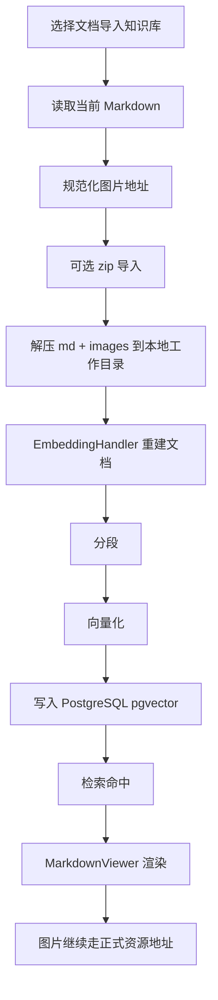

# ai5g 后端目录

用于承载文档管理与内容检索相关的个性化后端代码，严格限定在 `org.jeecg.modules.biz.ai5g` 包下，避免改动平台主干代码。

## 建议结构
- `controller/` Web 接口层（REST 控制器）
- `service/` 业务服务层（接口与实现）
- `entity/` 数据实体（JPA/MyBatis-Plus）
- `mapper/` 持久层（MyBatis-Plus Mapper）
- `dto/vo/` 数据传输对象与视图对象
- `config/` 仅限本业务必要的局部配置
- `aspect/` 仅限 ai5g 业务的局部拦截逻辑

## 约定
- 返回统一使用平台 `Result<T>`
- 统一前缀路径建议：`/ai5g`（控制器上 `@RequestMapping("/ai5g")`）
- 依赖尽量复用平台组件（如权限、字典、文件存储、Redis、日志等）
- 文档与资源只保留当前正式上传逻辑，不保留历史兼容分支。

## 文档处理
1. 文档上传后，源文件进入 MinIO 的 `doc/files/yyyyMM/`。
2. `docx` / `doc` / `pptx` / `ppt` 先通过 LibreOffice 转 PDF，再由 MinerU 解析为 Markdown。
3. `docx` 转 PDF 时，实际执行的是 `soffice --headless --convert-to pdf <source> --outdir <tmpOutDir>`，并配合临时 `UserInstallation` 目录避免并发和权限问题。
4. 这里使用的 MinerU / `magic-pdf` 不是 PDF-only，当前链路会把 `docx`、`pdf` 等正式文档都交给同一套解析流程，输出统一的 Markdown 与资源包。
5. 资源包类文档只把主 Markdown 和 Markdown 引用的图片上传到 `doc/packages/{packageId}/`；MinerU 生成的 PDF/JSON 中间文件不上传 MinIO。
6. Markdown 预览时，图片统一通过 `/ai5g/doc/assets/{docId}/...` 代理读取。
7. 文档管理页“导入知识库”直接读取当前 Markdown 内容，不再依赖原始源文件。
8. 导入前会把 Markdown 中的图片地址统一规范为 `#{domainURL}/ai5g/doc/assets/{docId}/...`，避免重复拼接域名前缀。
9. MinerU API 模式为异步转换，任务提交后写入 `convertStartedAt/mineruTaskId/mineruTaskStatus`，后台轮询并同步排队、开始、完成、错误状态。
10. 后端启动时会恢复 `processing` 且已有 `mineruTaskId` 的转换任务；成功保存结果后清理历史失败备注。

## 文档表

### `biz_ai5g_doctype`
文档分类表，三层结构：
- `level`：层级，固定 1/2/3
- `code`：分类编码，系统按编码做树形关系和筛选
- `name`：展示名称
- `parent_code`：父级编码
- `status`：启用状态

### `biz_ai5g_docfile`
文档主表，一条记录对应一个文档版本：
- `category_path`：分类路径，只记录分类编码，不参与文件存储
- `storage_path`：当前源文件路径，MinIO 场景下为完整对象 URL
- `storage_filename`：当前源文件对象名
- `md_path`：当前 Markdown 路径
- `asset_root`：资源包根目录，例如 `doc/packages/{packageId}/`
- `asset_manifest`：资源清单 JSON，记录资源包内相对路径与对象名映射
- `source_package_path`：原始资源包或源文件路径
- `convert_started_at`：文档转换任务提交时间
- `mineru_task_id`：MinerU 异步任务 ID
- `mineru_task_status`：MinerU 任务状态，`pending/processing/completed/failed`
- `mineru_queued_ahead`：MinerU 排队前任务数
- `mineru_error`：MinerU 任务错误信息
- `mineru_started_at`：MinerU 任务开始时间
- `mineru_completed_at`：MinerU 任务完成时间

## 文档存储规则
- 源文件：`doc/files/yyyyMM/{fileName}`
- 资源包根目录：`doc/packages/{packageId}/`
- 资源包源文件：`doc/packages/{packageId}/_source/{zipName}`
- 主 Markdown：通常位于资源包目录下，与转换结果同目录保存
- 图片资源：资源包目录下的子路径，通常来自 MinerU 输出的 `images/...`

## 文档关联关系
- `biz_ai5g_doctype.code` 只负责分类树，不参与 MinIO 目录拼接。
- `biz_ai5g_docfile.category_path` 只负责查询和展示分类，不负责文件定位。
- `biz_ai5g_docfile.asset_root` + `asset_manifest` 决定图片资源的真实对象位置。
- `biz_ai5g_docfile.md_path` 决定 Markdown 内容所在对象。
- `biz_ai5g_docfile.storage_path` 决定原始文件所在对象。
- `asset_manifest` 使用 `LONGTEXT`，大文档图片较多时不会触发字段超长；`remark` 使用 `TEXT`。

## AIRag 知识库
- AIRag 导入优先使用已转换好的 Markdown 内容，而不是原始源文件。
- AIRag 的文档导入只负责“可检索文本 + 可访问图片路径”，不再承担文档格式转换。
- 只有当 Markdown 中的图片仍指向当前正式资源地址时，图片才会在检索命中后正常显示。
- AIRag 的 zip 导入会将 md 和图片解压到本地工作目录，随后重建向量。
- AIRag 的向量存储在 PostgreSQL pgvector 表中，不落文件系统。

## AIRag 关联关系
- `airag_knowledge_doc.metadata.filePath` 保存当前可读的 Markdown 路径。
- `airag_knowledge_doc.metadata.sourcesPath` 保存 Markdown 对应的资源目录。
- `EmbeddingHandler` 读取 `filePath` 后做分段、向量化并写入 pgvector。
- 命中结果的图片展示依赖 Markdown 中的图片 URL 可被前端直接访问。

## 说明
- Word/PDF 转 Markdown 时，Office 先通过 LibreOffice 预转 PDF，再走 MinerU 解析，失败后再走文本兜底。
- Pandoc/Tika 兜底仅保证文本可读，不保证图片可用。
- 文档查看页和文档管理页都直接消费后端返回的 Markdown 内容，不再做历史路径兼容。
- 文档管理页状态展示：`success` 显示“转MD成功”，`failed` 显示“转MD失败”，`processing` 显示排队/解析/耗时信息。
- 文档管理页的“预览”优先展示 PDF 结果，标题栏的“下载原件”则返回原始上传文件。
- Markdown 重新导入 AIRag 时，如果图片路径已经是当前正式资源地址，就不再打 zip；只有需要完全自包含资源包时，才考虑目录打包导入。

## 流程图

### 文档管理预览与解析
```mermaid
flowchart TD
    A[上传文档] --> B[MinIO: doc/files/yyyyMM/]
    B --> C[文档管理预览]
    C --> D{是否 Office 文档}
    D -- 是 --> E[先查同名 PDF]
    E -- 不存在 --> F[LibreOffice soffice 转 PDF]
    F --> G[返回 PDF 给前端预览]
    D -- 否 --> H[直接返回原文件或文本]
    B --> I[解析链路]
    I --> J[LibreOffice 预转 PDF]
    J --> K[MinerU / magic-pdf 解析]
    K --> L[生成 Markdown + 资源包]
    L --> M[Markdown 预览]
    M --> N[/ai5g/doc/assets/{docId}/... 代理图片]
```

### AIRag 导入与检索


## 变更规则
- 原则上不得修改本目录以外的源代码；如确需修改平台通用类，请复制到本目录下并以不影响原有模块的方式改造（包路径 `org.jeecg.modules.biz.ai5g.*`）。
- 复用平台提供的工具与配置，避免新增全局配置或切面，若必须使用，请限定作用域在 `ai5g` 业务内。

## 可复用清单（示例）
- 通用返回体：`org.jeecg.common.api.vo.Result`
- 缓存：`org.jeecg.common.util.RedisUtil`
- 日志与权限：平台已有切面与注解
