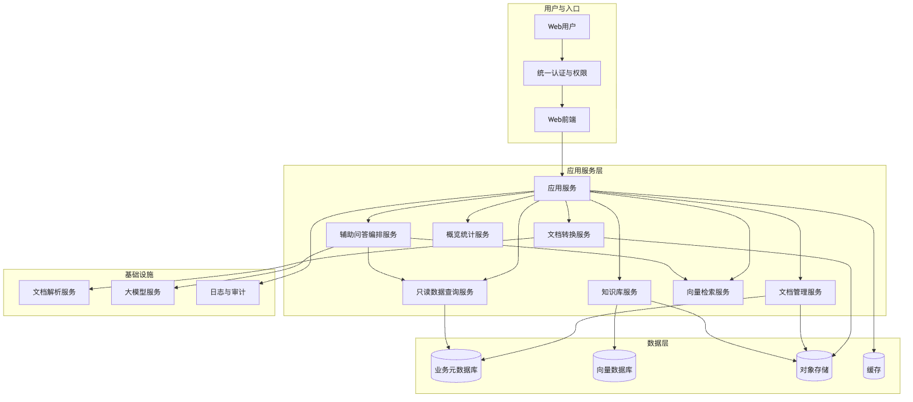
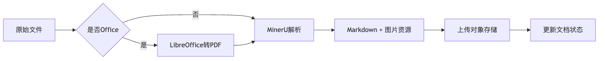
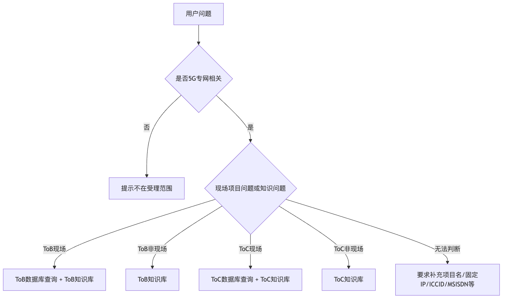
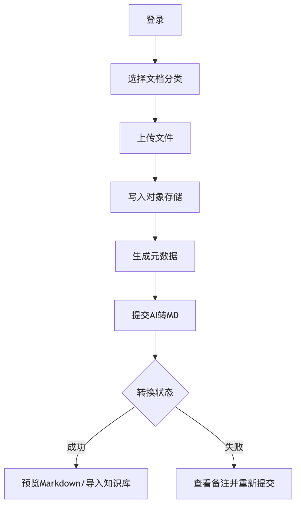
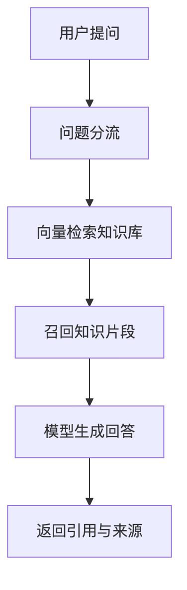
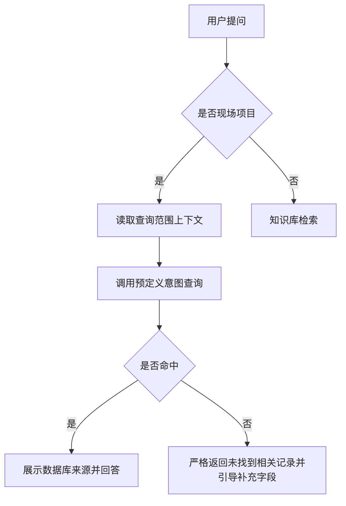
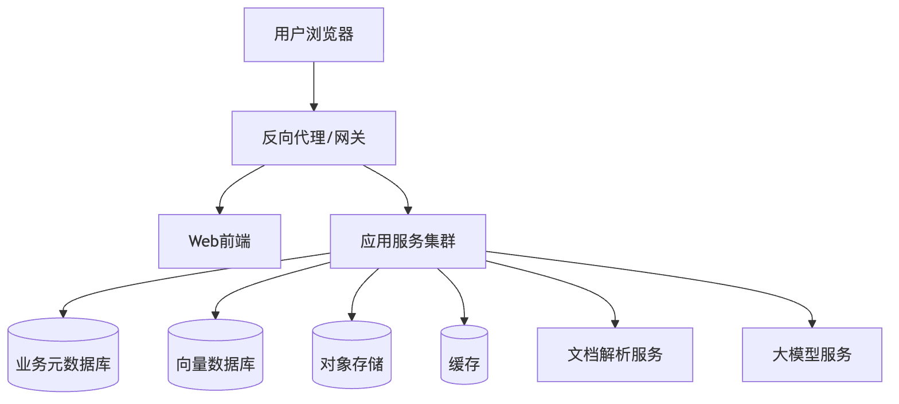

# 软件设计说明书

## 1. 文档信息

| 项目 | 内容 |
| --- | --- |
| 项目名称 | 5G专网运营支撑系统（一期） |
| 文档版本 | V1.0 |
| 编制日期 | 2026年8月24日 |
| 编制状态 | 结项文档 |
| 密级 | 内部 |

> 说明：本平台一期定位为“文档管理、知识库检索、项目数据查询与辅助问答”，不作为完整智能体验收。完整的自主任务编排、多工具协同、智能体工作流等能力列入二期规划。

## 2. 设计目标与原则

### 2.1 建设目标

本平台面向5G专网业务中的文档与知识管理需求，解决以下问题：

1. 5G专网交付、运维、开通、MEC、随行专网等资料分散在Word、PDF、Excel和网管反馈文档中，缺少统一管理入口。
2. 业务人员检索资料依赖文件名或人工记忆，难以基于正文内容快速定位。
3. 随行专网项目、网络资源、地址池、路由、CPE、SIM卡等结构化数据与知识文档分离，查询链路不统一。
4. AI能力需要在一个受控、可解释、可审计的范围内提供辅助问答，不能在没有数据来源时进行推测。

### 2.2 设计原则

- **数据可追溯**：文档源文件、Markdown结果、知识库片段、数据库查询来源均保留可追踪信息。
- **检索与查询分离**：知识文档走语义检索，结构化数据走只读数据查询，二者不得混同。
- **严格事实约束**：未命中数据库时返回“未找到相关记录”，未命中知识库时返回“知识库中暂未找到相关记录”，禁止编造。
- **异步处理**：文档解析、Markdown生成、向量化等耗时操作采用异步任务，避免阻塞页面。
- **安全可控**：数据查询仅开放只读能力，按查询范围限制可访问表，文件资源按文档维度限制访问路径。
- **易扩展**：文档分类、查询范围、知识库、模型服务均支持后续扩展，二期可继续演进为更完整的智能体。

## 3. 总体架构

### 3.1 分层架构

平台采用分层架构，按职责划分为表现层、应用服务层、数据层和基础设施层。


### 3.2 组件说明

| 组件 | 职责 |
| --- | --- |
| Web前端 | 提供文档管理、文档概览、知识库管理、项目数据查询、AI辅助问答等页面 |
| 统一认证与权限 | 负责用户登录、角色授权、菜单权限和数据接口访问控制 |
| 文档管理服务 | 处理文档分类、上传、版本、编辑、删除、预览、概览统计 |
| 文档转换服务 | 将Word、PDF等文件转换为Markdown，并管理转换任务状态 |
| 知识库服务 | 将Markdown导入知识库、分段、向量化，并维护知识库文档 |
| 向量检索服务 | 根据用户问题召回知识片段，返回命中内容和来源引用 |
| 只读数据查询服务 | 在限定表和预定义意图范围内执行只读查询 |
| 辅助问答编排服务 | 对用户问题进行业务分流，组合知识检索和数据库查询结果生成回答 |
| 对象存储 | 保存原始文件、Markdown、图片资源包等非结构化数据 |
| 业务元数据库 | 保存文档元数据、分类、删除标记、查询范围配置 |
| 向量数据库 | 保存知识文档向量和检索所需的元数据 |
| 文档解析服务 | 完成Office到PDF预转换、MinerU解析、Markdown与资源生成 |
| 大模型服务 | 提供问题分类、答案生成、语义理解等模型能力 |

### 3.3 架构边界

- 前端页面和业务代码集中在独立业务模块内，不侵入通用平台代码。
- 结构化数据查询仅允许读取业务项目表，禁止执行增删改、DDL和未授权表访问。
- 文件资源通过资源代理接口读取，路径限制在当前文档资源包目录内。
- AI问答流程对数据库结果和知识库结果分别约束，不将知识库内容伪装为数据库结果。

## 4. 模块设计

### 4.1 文档分类管理

文档分类采用三级结构：

- 一级分类：如规范、办公操作、业务办理、项目资料、案例、QA等。
- 二级分类：如专网办理规范、运维手册等。
- 三级分类：用于更细粒度的资料归档。

分类字段包括：

- `level`：层级，取值为1、2、3。
- `code`：分类编码，用于树形关系和筛选。
- `name`：展示名称。
- `parent_code`：父级编码。
- `status`：启用状态。

分类编码与存储目录解耦，避免调整分类名称后导致文件路径变更。

### 4.2 文档上传与版本管理

#### 4.2.1 上传

文档上传流程：

1. 用户选择三级分类、显示名称、文件年份和备注。
2. 上传接口校验文件类型和大小。
3. 原始文件写入对象存储，目录规则为`doc/files/yyyyMM/`。
4. 文档元数据写入文档主表，初始状态为已上传。
5. 系统记录版本号、是否最新、上传时间、创建人等审计信息。

#### 4.2.2 版本

每个文档版本对应一条文档记录，`latest`字段标记当前最新版本。文档列表和概览统计分别展示“最新”记录和全部历史记录。

### 4.3 文件预览

- PDF：直接返回PDF预览。
- Office文档：使用文档解析服务预转换为PDF后预览；转换失败时允许下载原文件。
- 图片：直接展示。
- 文本和CSV：返回文本或Markdown表格。
- Markdown：返回Markdown预览，并支持在线编辑保存。
- 资源包：通过资源代理接口读取包内图片，避免将对象存储密钥暴露给前端。

### 4.4 AI转Markdown

#### 4.4.1 处理链路


#### 4.4.2 任务状态

| 状态 | 含义 |
| --- | --- |
| uploaded | 已上传，未提交转换 |
| processing | 排队中、解析中或生成中 |
| success | 转MD成功 |
| failed | 转MD失败 |

转换任务记录以下关键时间与状态：

- 提交时间
- MinerU任务ID
- MinerU任务状态
- 排队前任务数
- 开始时间
- 完成时间
- 错误信息

后端启动时会恢复处理中且已有任务ID的转换任务，避免服务重启后任务永久悬挂。

#### 4.4.3 结果保存规则

- 只上传主Markdown文件和Markdown引用的图片资源。
- MinerU生成的PDF、JSON等中间文件不进入正式对象存储。
- 图片资源关系通过资源包根目录、资源清单JSON和Markdown图片链接共同表达。
- 图片清单字段使用大文本类型，避免大文档资源过多时发生截断。
- `size`字段始终表示原始上传文件大小，不因Markdown生成而覆盖。

### 4.5 知识库导入与向量化

#### 4.5.1 导入流程

1. 用户从文档管理页选择“导入知识库”。
2. 系统读取当前Markdown内容。
3. 图片地址规范化为可跨环境访问的代理地址。
4. 知识库服务将Markdown写入知识库文档表。
5. 文档按业务需要分段。
6. 分段内容调用向量模型生成向量并写入向量数据库。

#### 4.5.2 检索

- 输入用户问题后，按向量相似度召回知识片段。
- 支持配置召回数量和相似度阈值。
- 返回内容包含知识库文档引用信息。
- Markdown图片在预览和问答页面继续通过资源代理展示。

### 4.6 随行专网数据查询

#### 4.6.1 数据范围

ToC随行专网查询覆盖：

- 项目汇总
- 网络资源
- 地址池与路由
- 文档片段
- 查询语义指南

#### 4.6.2 查询能力

页面支持：

- 按项目、关键词筛选。
- 项目总览及项目基础信息编辑。
- 网络资源分页查询。
- 地址池与路由分页查询。
- 文档检索片段查询。
- 汇总指标统计。

分页接口单页最大200条，防止单次查询返回过大结果。

### 4.7 ToB物联网专网数据查询

ToB查询覆盖项目、CPE配置、SIM卡、摄像头配置和文档片段，并提供CPE与SIM卡联查视图。查询能力通过受限只读查询服务开放给AI辅助问答和后续业务页面。

### 4.8 只读数据查询服务

#### 4.8.1 查询范围

查询范围配置保存于查询范围表，包含：

- 范围编码和名称
- 允许访问的表/视图
- 查询规则
- 提示词和示例
- 启用状态

当前配置范围：

| 范围 | 数据 |
| --- | --- |
| ToC随行专网 | 项目、网络资源、地址池路由、文档片段 |
| ToB物联网专网 | 项目、CPE、SIM卡、摄像头、文档片段 |

#### 4.8.2 安全校验

- 仅允许以`SELECT`开头的查询。
- 禁止分号、注释和危险关键字。
- 查询引用的表必须在允许表清单内。
- 未显式`LIMIT`时自动追加分页。
- 单页最大200条。

#### 4.8.3 查询工具

对外提供四类工具能力：

1. 查询范围列表。
2. 查询范围上下文，包含表、字段、规则和示例。
3. 预定义意图查询，优先使用，减少模型猜测字段。
4. 安全只读查询，用于预定义意图未覆盖的场景。

### 4.9 辅助问答服务

#### 4.9.1 分流规则


#### 4.9.2 严格回答约束

- 与5G专网、ToB物联网专网、ToC随行专网无关的问题，直接提示不在受理范围。
- 具体ToB现场项目问题先查ToB数据库，再结合ToB知识库回答。
- 具体ToC现场项目问题先查ToC数据库，再结合ToC知识库回答。
- 数据库未命中时严格回复“未找到相关记录”，并请用户补充项目名称、项目编码、固定IP、ICCID、MSISDN、车辆/设备编号、DNN、ServiceID、UPF等关键信息。
- 知识库未命中时严格回复“知识库中暂未找到相关记录”。
- 禁止编造、禁止推测、禁止隐瞒空结果。
- 数据库命中时在回答开头保留“数据来源：AI5G专网查询插件（ToB数据库/ToC数据库）”标注，前端同步展示数据库来源标签。
- 知识库引用中的附件名、文件名属于知识库内容；只要正文片段已给出，必须按正文回答，不得声称未提供该附件内容。

#### 4.9.3 多轮上下文

问答入口支持携带历史记录，使模型可以结合上一轮补充的项目名、固定IP、ICCID、MSISDN等关键信息继续查询。

#### 4.9.4 一期边界

- 一期实现受限问题分流、知识检索、只读数据查询、来源标注和严格空结果约束。
- 不将本项目宣传为完善智能体。
- 二期可扩展自主任务执行、多工具编排、Rerank精排、混合检索、主动澄清和运维工单联动等能力。

### 4.10 文档概览统计

概览页提供：

- 文档记录总数和最新版本数。
- 转换处理中、转MD成功、转MD失败数量。
- 可用Markdown数量。
- 源文件总大小。
- 转换状态分布。
- 文件类型分布。
- 分类路径分布。

统计范围包含历史版本，最新版本以`latest=1`标记。源文件总大小按原始上传文件统计。

### 4.11 删除与清理

删除流程：

1. 删除数据库中的文档记录。
2. 写入删除清理标记。
3. 清理对象存储中的源文件、Markdown和资源包。
4. 清理成功更新清理状态，清理失败保留失败标记。
5. 后端启动时自动重试失败清理。

该机制避免“数据库记录已删除但对象存储文件残留”的问题。

## 5. 核心业务流程图

### 5.1 文档管理流程


### 5.2 知识库检索流程


### 5.3 项目数据查询流程


## 6. 数据模型设计

### 6.1 文档分类表

| 字段 | 说明 |
| --- | --- |
| id | 主键 |
| level | 层级，1/2/3 |
| code | 分类编码 |
| name | 分类名称 |
| parent_code | 父级编码 |
| status | 启用状态 |
| create_time | 创建时间 |
| update_time | 更新时间 |

### 6.2 文档主表

| 字段 | 说明 |
| --- | --- |
| id | 主键 |
| actual_file_name | 实际存储文件名 |
| original_name | 原始文件名 |
| display_name | 展示名称 |
| version | 版本号 |
| upload_time | 上传时间 |
| file_type | 文件扩展名 |
| category_path | 分类路径 |
| file_year | 文件年份 |
| remark | 备注 |
| latest | 是否最新版本 |
| process_status | 转换状态 |
| content_type | 文件MIME类型 |
| size | 原始上传文件大小 |
| storage_path | 源文件路径 |
| storage_filename | 源文件对象名 |
| md_converted | 是否已生成Markdown |
| md_path | Markdown路径 |
| asset_root | 资源包根目录 |
| asset_manifest | 资源清单JSON |
| source_package_path | 原始资源包路径 |
| convert_started_at | 转换任务提交时间 |
| mineru_task_id | 解析任务ID |
| mineru_task_status | 解析任务状态 |
| mineru_queued_ahead | 排队前任务数 |
| mineru_error | 错误信息 |
| mineru_started_at | 解析开始时间 |
| mineru_completed_at | 解析完成时间 |
| create_by/create_time | 创建审计 |
| update_by/update_time | 更新审计 |

### 6.3 删除清理表

| 字段 | 说明 |
| --- | --- |
| id | 主键 |
| source_object | 源文件对象 |
| md_object | Markdown对象 |
| asset_root | 资源包前缀 |
| source_package_object | 原始资源包对象 |
| status | pending/cleaned/failed |

### 6.4 查询范围配置表

| 字段 | 说明 |
| --- | --- |
| scope_code | 查询范围编码 |
| scope_name | 范围名称 |
| scope_type | 范围类型 |
| description | 范围说明 |
| allowed_tables | 允许查询的表/视图 |
| base_prompt | 模型提示词 |
| query_rules | 查询规则 |
| examples | 示例问题和示例SQL |
| enabled | 是否启用 |
| sort_no | 排序 |

### 6.5 ToC随行专网数据模型

| 表/视图 | 说明 |
| --- | --- |
| 项目主表 | 随行专网项目基本信息 |
| 网络资源表 | GRE、IPRAN、MAR、VPN、VLAN等资源 |
| 地址池与路由表 | UPF终端地址池、目的网段、下一跳、VPN/VRF |
| 文档片段表 | 申请表、网管反馈和说明内容的语义片段 |
| 查询语义指南表 | 数据库查询工具使用的字段、规则和示例 |
| 项目汇总视图 | 项目数量、开通状态、预计用户、资源数和路由数 |

### 6.6 ToB物联网专网数据模型

| 表/视图 | 说明 |
| --- | --- |
| 项目主表 | ToB项目基本信息 |
| CPE配置表 | CPE、车辆/设备、固定IP、服务类型 |
| SIM卡表 | ICCID、MSISDN、SIM卡状态 |
| 摄像头配置表 | 摄像头设备及配置信息 |
| 文档片段表 | ToB项目资料语义片段 |
| CPE/SIM联查视图 | CPE与SIM卡按项目和服务类型联查 |

### 6.7 知识库模型

知识库主体包括：

- 知识库基本信息：名称、描述、向量模型、状态。
- 知识库文档：标题、内容、状态、所属知识库。
- 向量数据：文档分片的向量和元数据，保存于向量数据库。

## 7. 接口设计

### 7.1 文档管理

| 方法 | 路径 | 说明 |
| --- | --- | --- |
| POST | /ai5g/doc/upload | 上传文档 |
| POST | /ai5g/doc/import/zip | 上传Markdown资源包 |
| GET | /ai5g/doc/page | 分页查询文档 |
| GET | /ai5g/doc/overview | 文档概览统计 |
| GET | /ai5g/doc/get/{id} | 查询文档详情 |
| POST | /ai5g/doc/convert/{id} | 提交AI转Markdown |
| GET | /ai5g/doc/preview/{id} | 文件预览 |
| GET | /ai5g/doc/preview-md/{id} | Markdown预览 |
| GET | /ai5g/doc/assets/{id}/** | 资源包图片代理 |
| DELETE | /ai5g/doc/remove/{id} | 删除文档并清理资源 |

### 7.2 分类管理

| 方法 | 路径 | 说明 |
| --- | --- | --- |
| POST | /ai5g/type/save | 保存分类 |
| GET | /ai5g/type/list | 按层级和父编码查询分类 |

### 7.3 随行专网查询

| 方法 | 路径 | 说明 |
| --- | --- | --- |
| GET | /ai5g/toc-private-network/summary | 汇总统计 |
| GET | /ai5g/toc-private-network/projects | 项目列表 |
| PUT | /ai5g/toc-private-network/projects/{projectCode} | 编辑项目基础信息 |
| GET | /ai5g/toc-private-network/resources | 网络资源分页 |
| GET | /ai5g/toc-private-network/routes | 地址池与路由分页 |
| GET | /ai5g/toc-private-network/documents | 文档片段分页 |
| GET | /ai5g/toc-private-network/guides | 查询语义指南 |

### 7.4 受限数据查询

| 方法 | 路径 | 说明 |
| --- | --- | --- |
| GET | /ai5g/mcp/domain-query/scopes | 查询范围列表 |
| GET | /ai5g/mcp/domain-query/context | 查询范围上下文 |
| POST | /ai5g/mcp/domain-query/intentQuery | 预定义意图查询 |
| POST | /ai5g/mcp/domain-query/safeSelect | 安全只读查询 |

### 7.5 返回结构

接口采用统一返回结构：

```json
{
  "success": true,
  "code": 200,
  "message": "操作成功",
  "result": {}
}
```

## 8. 安全设计

### 8.1 认证与授权

- 用户通过统一认证入口登录。
- 菜单、页面和接口按角色授权。
- 业务操作记录创建人、更新人和时间。

### 8.2 文件安全

- 上传文件使用SSRF类型过滤和业务允许类型校验。
- 资源包图片代理限制在当前文档资源包目录内，防止路径穿越。
- 对象存储访问密钥不暴露给前端。

### 8.3 数据查询安全

- 只允许只读SELECT。
- 禁止DML、DDL、危险函数、分号和注释。
- 表引用必须在允许清单内。
- 自动分页限制最大返回条数。
- 查询范围上下文对模型提供明确规则，降低SQL猜测风险。

### 8.4 AI回答安全

- 强制要求模型仅使用知识库和数据库查询结果。
- 空结果必须如实说明。
- 来源标注用于区分数据库结果和知识库结果。
- 避免模型将知识文档内容误判为数据库查询结果。

## 9. 部署架构

### 9.1 部署组件

| 组件 | 作用 |
| --- | --- |
| Web前端 | 部署静态页面，通过网关访问后端服务 |
| 应用服务 | 提供业务接口、异步任务和AI编排 |
| 业务元数据库 | 保存文档、分类、查询范围和审计数据 |
| 向量数据库 | 保存知识向量 |
| 缓存 | 保存会话和临时状态 |
| 对象存储 | 保存源文件、Markdown和图片资源 |
| 文档解析服务 | 执行Office转PDF和MinerU解析 |
| 大模型服务 | 提供问题分类、向量化和回答生成 |
| 反向代理 | 提供HTTPS、路由转发和静态资源访问 |

### 9.2 部署拓扑


## 10. 非功能设计

### 10.1 性能

- 常规列表查询应支持分页。
- 文档转换和向量化为异步任务，不阻塞用户请求。
- 知识检索上下文设置合理上限，避免超出模型输入窗口。
- 大文档资源清单使用大文本字段，避免数据库截断。

### 10.2 可靠性

- 转换任务支持启动恢复。
- 删除清理支持失败重试。
- 文档预览失败时提供下载原文件兜底。
- 文档解析远程失败时可回退本地解析。

### 10.3 可维护性

- 文档分类、查询范围、知识库、模型配置均可通过管理界面或配置维护。
- 业务代码限定在独立业务模块内。
- 接口和数据结构保持稳定，便于二期扩展。

### 10.4 可观测性

- 系统日志记录关键业务动作和异常。
- 转换任务记录提交、排队、开始、完成、错误等时间点。
- 文档概览页提供状态和容量统计，便于运维观察。

